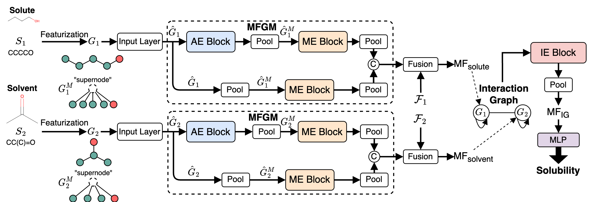
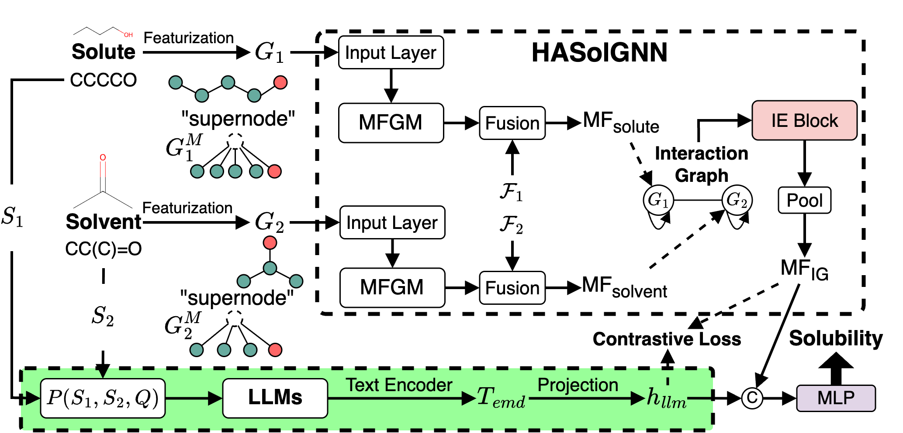
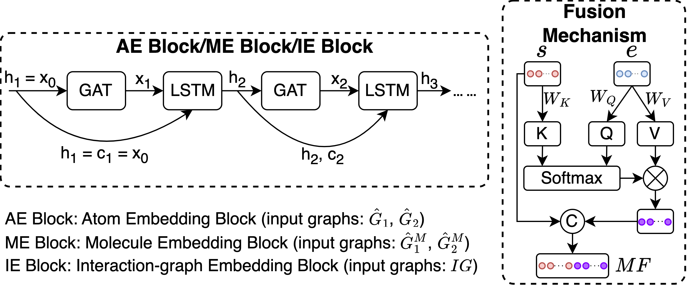

# HASolGNN
This repository contains the codes and datasets for the reproducibility of the experiments presented in the paper "Hierarchical-Attention Graph Learning for Solubility Prediction". 

This paper proposes HASolGNN, a hierarchical-attention graph neural networks for solubility prediction. (1) HASolGNN adopts a three-level hierarchical attention framework to characterize atom-bond level, molecular level, and interaction-graph level features. This allows a more comprehensive modeling of both intra-molecular and inter-molecular interactions for solute-solvent dissolution as a complex dynamic system. (2) To mitigate the impact of small annotated data, We also investigate the role of Large Language Models (LLMs), and introduce HASolGNN-LLMs, an LLM-enhanced counterpart that leverages LLMs to infer annotated features and embeddings to improve the representation learning. Our experiments verified that (1) HASolGNN outperforms the state-of-the-art methods in solubility prediction; and (2) HASolGNN-LLMs effectively exploit LLMs to enhance sparse annotated data, and further improves the accuracy.

## Organization of the code

All the code for the models described in the paper can be found in *codes. 
We provide the datasets used in our experiments for users to validate our proposed methods located in: *Datasets.

We propose __HASolGNN__, an expressive framework that can capture hierarchical, multi-level interactions and patterns among
atom, bond, and (inter- and intra-) molecular. HASolGNN enables solubility prediction across a wide range of solute-solvent pairs, irrespective of solvent types. HASolGNN achieves above through the integration of hierarchical attention mechanisms across three key components: the atom embedding (AE) block, the molecular embedding (ME) block, and the interaction-graph embedding (IE) block. Experimental results demonstrate that HASolGNN significantly outperforms the state-of-the-art graph neural networks methods, establishing new benchmarks in performance

  
**Fig. 1: Overview of HASolGNN Framework.**

To mitigate the challenge posed by small annotated datasets, We present __HASolGNN-LLMs__, an LLM-enhanced variant of HASolGNN. It leverages LLMs as (1) a feature enricher: expanding the feature space and enhancing molecular representations to maximize the utility of available context for solubility prediction, from unstructured textual input such as lab, instrument or literatures; and (2) a pseudo-annotator: providing estimations of solubility that are guided by proper prompting, conforming to the context.

  
**Fig. 2: Overview of HASolGNN-LLMs Framework.**

  
**Fig. 3: Detailed View of the AE/ME/IE Bloack and Fusion mechanism.**

## Prerequisites
Our code is based on Python3 (>= 3.11). The major libraries are listed as follows:
* NumPy (>= 1.26.3)
* Pandas (>= 2.0.1)
* Torch (>= 2.3.1)
* PyG (PyTorch Geometric) (>= 2.0.4)

